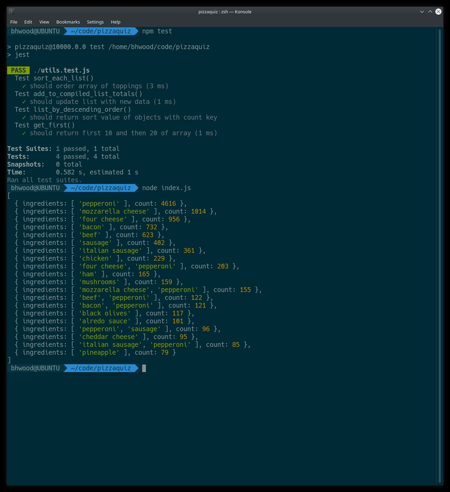

# pizzaquiz
Pointless pizza topping number cruncher

For Mr. Joiner,

It's a node.js application.

I worked on it while my kids were asleep.  I will forget to send it to you.  So I'm sending it now.

I would have refactored a bit of it but I didn't want to use to much functional programming because you wouldn't have been able to understand what was going on.  Used only Plain JavaScript so you wouldn't have to worry about and imported modules.  I checked and I think you should have all important modules available in JVM8 and up.  I threw in a `map()` so u could see it in the `utils.js` file.  Presentation stuff in the end I didn't worry about mutation of `compiled_list` because it is just for final output and would never be reused or included if Incorporated in an actual module.

Billy Wood

Executive Keyboard Banger MD. 

# Presto =>

